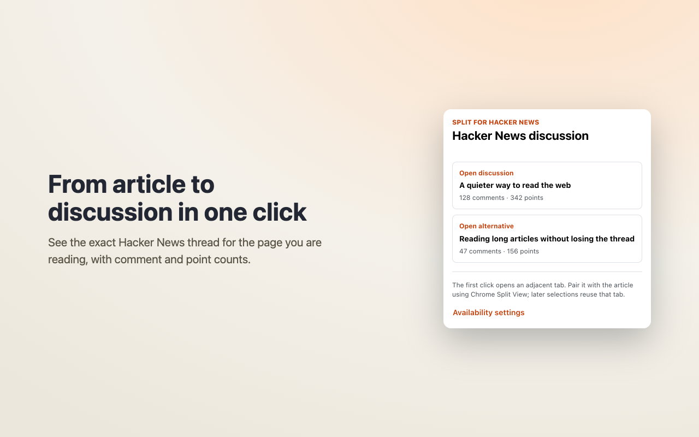

# Split for Hacker News

Find the Hacker News discussion behind the article you are reading, then open it beside the article or in a reusable adjacent tab. Free, open source (MIT), and unofficial. No telemetry, extension account, or developer-operated backend.

**[Install Split for Hacker News from the Chrome Web Store →](https://chromewebstore.google.com/detail/split-for-hacker-news/jmocibcalpebojmljmhlkeackggnkhfm)**

[Homepage](https://maximtop.dev/extensions/split-for-hacker-news/) · [Source](https://github.com/maximtop/hn-split) · [Privacy](PRIVACY.md) · [Support](https://github.com/maximtop/hn-split/issues)



## Highlights

- **Exact discussions, not fuzzy guesses.** URL candidates are normalized conservatively, every result is verified, and duplicate submissions remain available as alternatives.
- **Choose the reading flow.** Open comments in Chrome's side panel, or use an adjacent discussion tab. You pair the tabs manually with Chrome Split View; the extension does not create that layout.
- **Useful shortcuts, only when you ask.** Use **Open in Split** on a link, opt in to opening discussions beside Hacker News story clicks, or enable a comment-count toolbar badge.
- **An active companion when you want one.** An already-open side panel can follow active tabs automatically, or **Check this tab** can inspect one tab without changing the preference. Following is separate from the toolbar badge and off by default.
- **Fast return, best effort.** The panel can keep up to three recent real Hacker News discussions alive in memory, so switching back usually preserves the browser-managed position until eviction, reconnect, reload, or memory pressure resets it.
- **Private by default.** No analytics, telemetry, extension accounts, advertising, or developer-operated backend. Discussion lookups still connect to Algolia, and opened discussions connect to Hacker News. Toolbar checks, side-panel following, and Hacker News story-click handling are all off by default.
- **Localized for 40 languages.** The extension follows the browser's language and light or dark color scheme.

## Install and use

1. [Install the extension from the Chrome Web Store](https://chromewebstore.google.com/detail/split-for-hacker-news/jmocibcalpebojmljmhlkeackggnkhfm). Chrome 140 or newer is required.
2. Open an article and select Split for Hacker News from the toolbar.
3. Choose the primary discussion or an alternative, then open it in a tab or the side panel.
4. In an open side panel, use **Check this tab** once or enable **Follow tabs automatically** in one action. Following never opens the panel or rearranges tabs.

Nothing opens, moves, or replaces a tab until you explicitly select an action. Hacker News is the only discussion source, and the extension is free to use.

## Privacy

In the default manual mode, the extension reads the active page URL and its optional canonical URL only after you open the popup. An unchecked side-panel tab is not inspected until you choose **Check this tab** or opt in to following. Eligible sanitized public URLs are sent over HTTPS to Algolia's public Hacker News Search API to locate exact submissions; article text and other page content are never read. Found URL lookups may be reused for one hour and not-found lookups for ten minutes in session storage; restricted pages and failures are not added to that cache.

The side panel embeds the real Hacker News site. It may retain up to three recent cross-origin Hacker News documents in memory, but extension code does not read, message, serialize, cache, or restore their comments, DOM, focus, cookies, or scroll values. Those documents make normal requests to Hacker News with ordinary request metadata and any cookies the browser sends under its policy. While at least one panel is open, the extension temporarily removes Hacker News framing headers from Hacker News sub-frame responses, then removes the rule after the last panel closes. While active, the exception covers every Hacker News sub-frame in the browser profile, not just this panel. Removing the full CSP headers also removes Hacker News’s script restrictions and report-only policy inside those frames. The full permission boundary, session-only associations, reset conditions, outbound URL filtering, and Chrome Web Store data disclosures are documented in [PRIVACY.md](PRIVACY.md).

Local diagnostics stay in session storage (at most 1,000 entries / 1 MiB), survive background-worker suspension, and disappear when the browser session ends. In **Options → Diagnostics**, you can export a local support file or clear the log. No page URLs, article content, cookies, credentials, or raw error messages/stacks are retained in that log, and nothing is uploaded automatically. Exported files remain on your device until you delete them.

## Browser and release scope

The steps above describe Chrome 140 or newer. Edge uses the Chromium side panel; Firefox 140 or newer uses Firefox Sidebar and omits the HN story-click shortcut and Chrome Split View guidance. Safari is not an implemented target. [Browser-specific store links](https://maximtop.dev/extensions/split-for-hacker-news/) are on the homepage.

This README describes the current source. The public Chrome Web Store listing was still version 0.1.1 when checked on September 20, 2026; the source is 0.1.2. The v0.1.1 release tag already contains side-panel following and retained discussions, although its live Store description omits them. See the [public-copy audit and publication handoff](docs/public-copy.md).

## Product documentation

- [MVP product brief and decision record](docs/product-brief.md)
- [URL matching and Hacker News lookup contract](docs/url-matching.md)
- [Lifecycle after tab close or navigation](docs/lifecycle.md)
- [Priority locales](docs/locales.md)
- [Development and Chrome loading](docs/development.md)
- [Store listing master copy and visual assets](docs/store-listing.md)
- [Releasing and store deployment](docs/RELEASE.md)
- [Support and safe diagnostic export](docs/support.md)
- [Release health and rollback criteria](docs/release-health.md)
- [Post-MVP roadmap criteria](docs/post-mvp-roadmap.md)
- [Privacy](PRIVACY.md)

## Development

```bash
npm install --global pnpm@11.18.0
make install
make build
make check
```

Rspack writes the unpacked extension to `build/chrome`. Load that directory in Chrome 140 or newer.

`pnpm release` builds the Chrome, Edge, and Firefox store archives into `build/release`; tagged releases publish them with checksums, and store submission is a separate manual workflow ([docs/RELEASE.md](docs/RELEASE.md)).

## Support and license

Report problems or request features using the [GitHub issue templates](https://github.com/maximtop/hn-split/issues/new/choose). Read [Support](docs/support.md) for safe reporting and optional diagnostic export. The source is available under the [MIT License](LICENSE), and feature work is reviewed through pull requests targeting `master`.

Split for Hacker News is an unofficial, independent project and is not affiliated with or endorsed by Y Combinator or Hacker News.

## Developer workflow

Use `make install`, `make build`, `make start`, `make check`, and
`make package`. Builds default to Chrome; packaging is local only. See
[development guide](docs/development.md) for browser targets, output paths,
and the equivalent pnpm commands.
